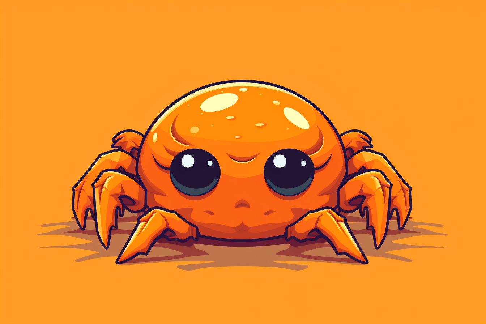
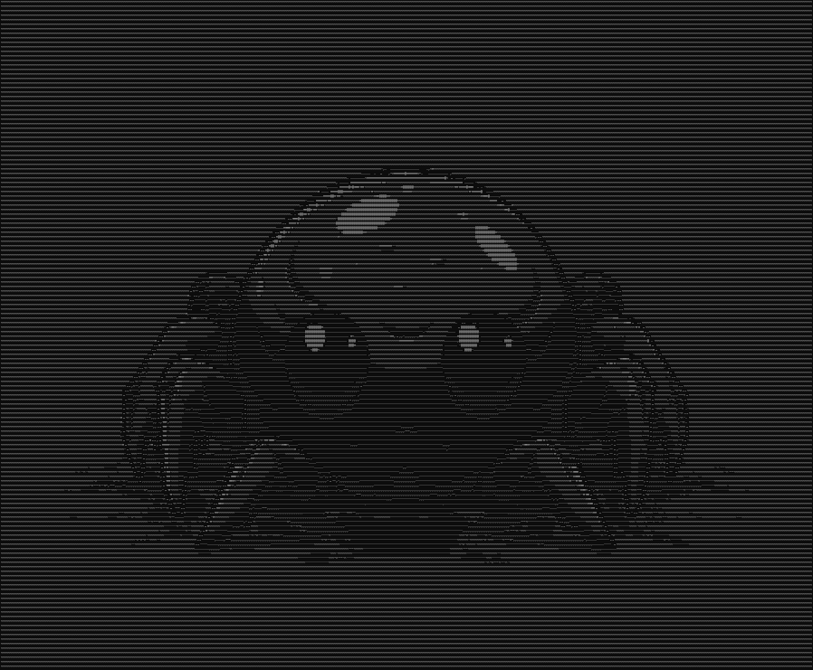
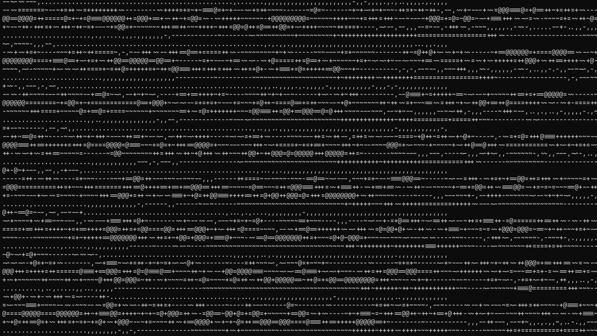
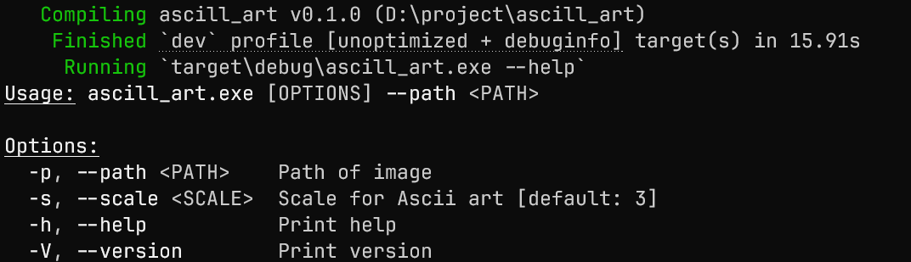

# ASCII Art Code in **_Rust_**

### About Rust

Rust is a systems programming language that has gained significant attention for
its focus on safety, speed, and concurrency. Developed by Mozilla and released
in 2010, Rust aims to provide a safe alternative to languages like C and C++
while maintaining similar performance. Its unique ownership model ensures memory
safety without needing a garbage collector, which is a significant advancement
in preventing common programming errors such as null pointer dereferencing and
buffer overflows.

### About the Project

This project generates ASCII art from normal images. ASCII art is made using
ASCII characters. I have used the following characters in this project: [" ",
".", ",", "-", "~", "+", "=", "@"].

### Example of the Project

#### Cute Ferris Image

#### Cute Ferris ASCII Image

#### Image Without Full Zoom

### How to Use It

- #### This is a CLI app. You can clone this project and build it with 'cargo run'.
- #### This image shows all arguments this CLI app takes:
  

---

### Examples

[Examples are here](/example)

#### Thank you to [@ezsnippat](https://www.youtube.com/@ezsnippat) for giving this idea
